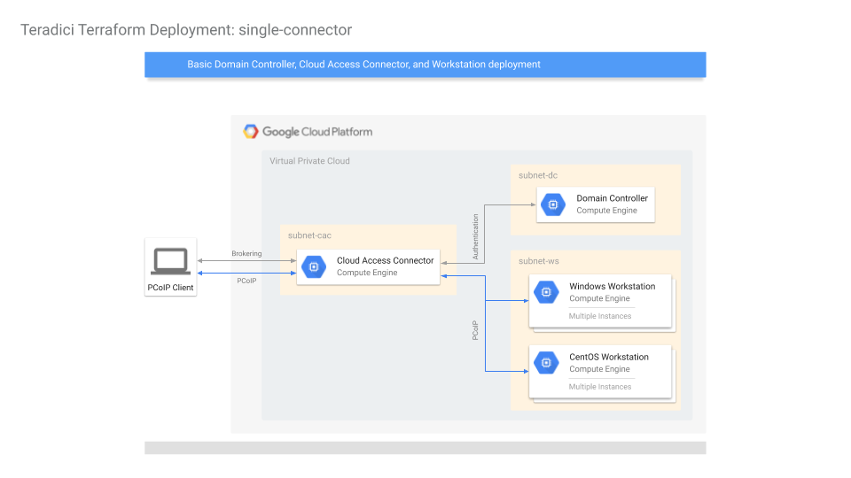
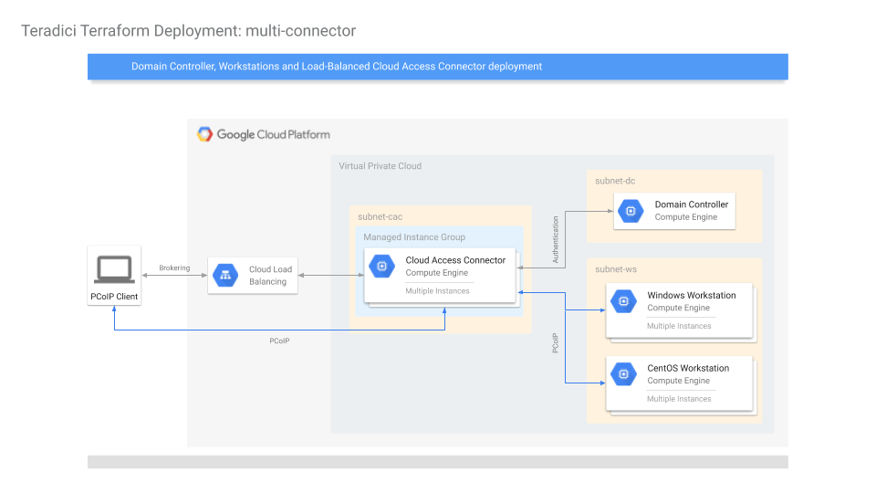
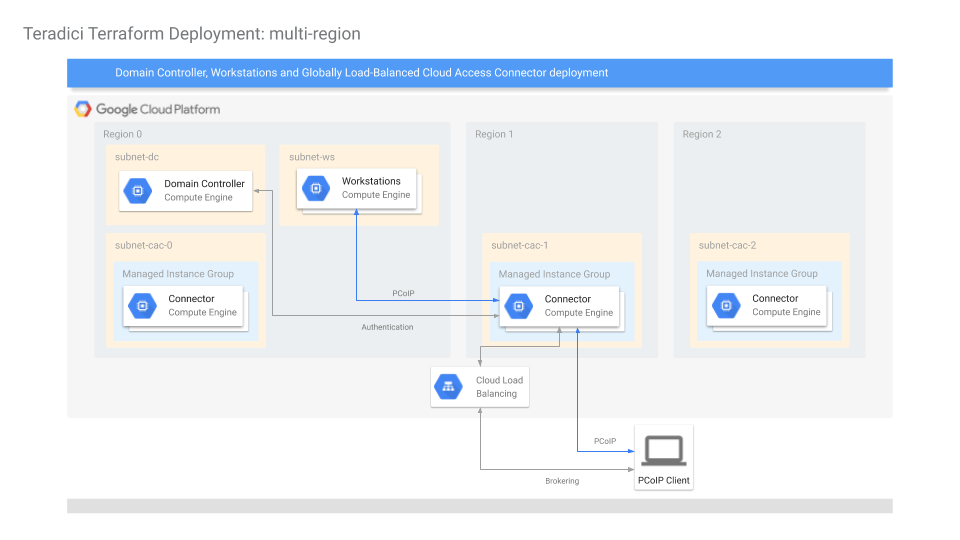

# Cloud Access Connector Deployment

Cloud Access Manager (CAM) enables highly-scalable and cost-effective Cloud Access Software deployments by managing cloud compute costs and brokering PCoIP connections to remote Windows or Linux workstations. The Cloud Access Manager solution is comprised of two main components – the Cloud Access Manager service, which is a service offered by Teradici to manage Cloud Access Manager deployments, and the Cloud Access Connector, which is the portion of the Cloud Access Manager solution that resides in the customer environment.  To learn more about Cloud Access Manager, visit https://www.teradici.com/web-help/pcoip_cloud_access_manager/CACv2/

This repository contains a collection of Terraform scripts for demonstrating how to deploy Cloud Access Connectors in a user's cloud environment. __Note: These scripts are suitable for creating reference deployments for demonstration, evaluation, or development purposes. The infrastructure created may not meet the reliability, availability, or security requirements of your organization.__

# GCP Quickstart Tutorial

The quickest way to create a reference deployment on GCP is to run the Quickstart Python script in the Google Cloud Shell. The goal is to automate the creation of a [single-connector deployment](#single-connector) as much as possible by using auto-generated values for required parameters.

Click on the button below to clone this repository in your GCP Cloud Shell and launch the tutorial.

[](https://console.cloud.google.com/cloudshell/open?git_repo=https://github.com/teradici/cloud_deployment_scripts&page=editor&tutorial=quickstart/tutorial.md)

# Running Terraform Scripts

## Requirments
- the user must have owner permissions to a GCP project
- A PCoIP Registration Code is needed. Contact Teradici sales or purchase subscription here: https://www.teradici.com/compare-plans
- an SSH private / public key pair is required for Terraform to log into Linux hosts.
- if SSL is invovled, the SSL key and certificate files are needed in PEM format.
- Terraform v0.12.x must be installed. Please download Terraform from https://www.terraform.io/downloads.html

## GCP Setup
Although it is possible to create deployments in existing and currently in-use projects, it is recommended to create them in new projects to reduce chances of name collisions and interfering with operations of existing resources.

With a new GCP project:
- create a new service account with __Editor__ and __Cloud KMS CryptoKey Encrypter/Decrypter__ permissions. Create and download the credentials in JSON format. These credentials are needed by CAM to manage the deployment, such as creating workstations, mointoring workstation statuses, and providing power management features.  The credentials are also needed by the Terraform scripts to create the initial deployment.
- Enable the following APIs in the GCP console or via the command ```gcloud services enable deploymentmanager.googleapis.com cloudkms.googleapis.com cloudresourcemanager.googleapis.com compute.googleapis.com dns.googleapis.com```:
    - Cloud Deployment Manager V2
    - Cloud Key Management Service (KMS)
    - Cloud Resource Manager
    - Compute Engine
    - Google Cloud DNS

## Cloud Access Manager Setup
Login to Cloud Access Manager Admin Console at https://cam.teradici.com using a Google G Suite, Google Cloud Identity, or Microsoft business account.
- create a new deployment and submit the credentials for the GCP service account created above.
- create a Connector in the new deployment. A connector token will be generated to be used in terraform.tfvars.

## Customizing terraform.tfvars
terraform.tfvars is the file in which a user specify variables for a deployment. In each deployment, there is a ```terraform.tfvars.sample``` file showing the required variables that a user must provide, along with other commonly used but optional variables. Uncommented lines show required variables, while commented lines show optional variables with their default or sample values. A complete list of available variables are described in the variable definition file ```vars.tf``` of the deployment.

Save ```terraform.tfvars.sample``` as ```terraform.tfvars``` in the same directory, and fill out the required and optional variables.

## Creating the deployment
With the terraform.tfvars file customized
- run ```terraform init``` to initialize the deployment
- run ```terraform apply``` to display the resources that will be created by Terraform
- answer ```yes``` to start creating the deployment
A typical deployment should take 15 to 30 minutes. When finished, the scripts will display a number of values of interest, such as the load balancer IP address.

At the end of the deployment, the resources may still take a few minutes to start up completely. Connectors should register themselves with the CAM service and show up in the CAM Admin Console. At that point, a user may go to the CAM Admin Console and add the newly created workstations using "Add existing remote workstation" in the "Remote Workstations" tab.  Note that it may take a few minutes for the workstation to show up in the "Select workstation from directory" drop-down box.

## Changing the deployment
Terraform is a declarative language to describe the desired state of resources. A user can modify terraform.tfvars and run ```terraform apply``` again. Terraform will try to only apply the changes needed to acheive the new state.

Note that changes involving creating or recreating Cloud Access Connectors requires a new connector token from the CAM Admin Console. Create a new connector to obtain a new token.

## Deleting the deployment
Run ```terraform destroy``` to remove all resources created by Terraform.

# Deployments
This section descrbes a number of scenarios deployed by Terraform scripts in this repository.

## single-connector
Creates a VPC with 3 subnets in the same region. The subnets are
- subnet-dc : for the Domain Controller
- subnet-cac: for the Connector
- subnet-ws : for the workstations

Firewall rules are created to allow wide-open access within the VPC, and selected ports are open to the world for operation and for debug purposes.

A Domain Controller is created with Active Directory, DNS and LDAP-S configured. 2 Domain Admins are set up in the new domain: Administrator and cam_admin (default). Domain Users are also created if a domain_users_list CSV file is specified. The Domain Controller is given a static IP (configurable).

A Cloud Access Connector is created and registers itself with the CAM service with the given Token and PCoIP Registration code.

Domain-joined Windows Graphics workstation(s), CentOS Graphics workstation(s), and CentOS Standard workstation(s) are optionally created, specified by ```win_gfx_instance_count```, ```centos_gfx_instance_count```, and ```centos_std_instance_count```.  These workstations are created with NVidia graphics driver (for graphics workstations) and PCoIP Agent installed.



## multi-connector
Same as single-connector, except multiple Cloud Access Connectors are deployed in a managed instance group comprising a single backend-service serving a GCP HTTPS Load Balancer
with a single Global Load Balanced IP address.

The number of Connectors can be specified by the ```cac_instances``` variable.



## multi-region
Similar to the multi-connector, except Cloud Access Connectors are deployed into managed instance groups in 3 different regions in the same VPC behind one global load balanced IP address.

This deployment demonstrates that the GCP HTTPS Load Balancer will connect a client to the Connectors that are geographically closest to the client.

Workstations are only deployed into one region to show that connectivity is possible from Connectors in any region because of GCP's global VPC.



## dc-only
A simple deployment of one Domain Controller, intended for testing Domain Controller operations.

Creates one VPC, one subnet and a single Domain Controller with ports opened
for ICMP, RDP and WinRM.  Domain Controller is configured with Acitve
Directory, DNS, LDAP-S.  One AD Service Account is also created.

# Directory structure
## deployments/
The top level terraform scripts that creates entire deployments.

## modules/
The building blocks of deployments, e.g. a Domain Controller, a Cloud Access
Connector, a Workstation, etc.

## quickstart/
Contains the Quickstart Tutorial and Python scripts for a quick deployment using Google Cloud Shell.

## tools/
Various scripts to help with Terraform deployments.  e.g. a Python script to
generate random users for an Active Directory in a CSV file.

# Maintainer
If any security issues or bugs are found, or if there are feature requests, please contact Sherman Yin at syin@teradici.com
