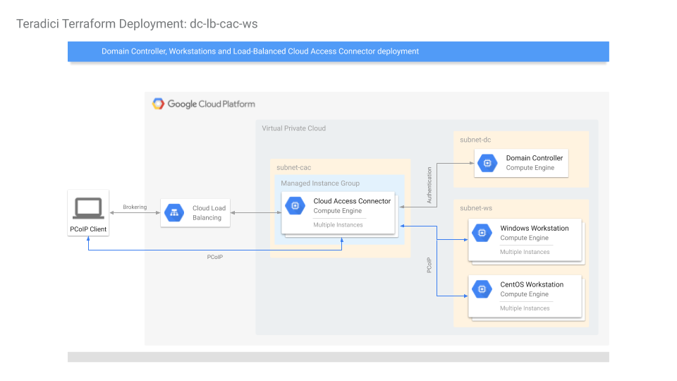

This repo contains Terraform scripts for creating various Cloud Access Manager
deployment scenarios in the cloud.

__Note: These scripts are suitable for creating deployments for demonstration or development purposes only. Do not use these for production environments.__

# Deployments
## dc-cac-ws
Creates a VPC with 3 subnets in the same region. The subnets are
- subnet-dc : for the Domain Controller
- subnet-cac: for the Connector
- subnet-ws : for the workstations

Firewall rules are created to allow wide-open access within the VPC, and
selected ports are open to the world for operation and for debug purposes.

A Domain Controller is created with Active Directory, DNS and LDAP-S configured.
2 Domain Admins are set up in the new domain: Administrator and cam_admin
(default). Domain Users are also created if a domain_users_list CSV file is
specified. The Domain Controller is given a static IP (configurable).

A Cloud Access Connector is created and registers itself with the CAM service
with the given Token and PCoIP Registration code.

Domain-joined Windows Graphics workstation(s), CentOS Graphics workstation(s), 
and CentOS Standard workstation(s) are optionally created, specified by 
win_gfx_instance_count, centos_gfx_instance_count, and centos_std_instance_count.  
These workstations are created with
NVidia graphics driver (for graphics workstations) and PCoIP Agent installed.

At the end of the deployment (~20 mins), a user should be able to go to the CAM
Admin Console and see the new connector added, and the newly created
workstations available for selection when adding existing remote workstation.


## dc-lb-cac-ws
Same as dc-cac-ws, except multiple Cloud Access Connectors are deployed in a
managed instance group comprising a single backend-service, behind a GCP HTTPS Load Balancer
with a single Global Load Balanced IP address.

The number of Connectors can be specified in one of two ways:
- a fixed number of instances, or
- (TODO) a minimum and maximum number of instances in an auto-scaled group.



## dc-only
A simple deployment of one Domain Controller, intended for testing Domain Controller operations.

Creates one VPC, one subnet and a single Domain Controller with ports opened
for ICMP, RDP and WinRM.  Domain Controller is configured with Acitve
Directory, DNS, LDAP-S.  One AD Service Account is also created.

## google-next-2019
Deploys the environment for the on stage and at the booth demos. Because this
is a specific deployment for the demo, it contains some hard coded values.
The deployment is similar to dc-cac-ws, except there will be 3 connectors in
3 regions: US West, US Central (called on-prem), and US East.

The following are the differences from dc-cac-ws:
- 3 connector subnets are created, one for each of the 3 regions.
- 3 connectors are deployed - one for each of 3 regions
- 1 Windowns Graphics and 2 CentOS Graphics workstations are deployed in US
  West (chosen for proximity to the Convention, which is in San Francisco)

# Preperation
## GCP Setup
Although it is possible to create deployments in existing and currently in-use projects, it is recommended to create them in new projects to reduce chances of name collisions and interfering with operations of existing resources.

With a new GCP project:
- create a new service account with __Editor__ and __Cloud KMS CryptoKey Encrypter/Decrypter__ permissions. Download the credentials in JSON format and reference this file in terraform.tfvars.
- enable guest attributes for the project by running ```gcloud compute project-info add-metadata --metadata enable-guest-attributes=TRUE``` in the Cloud Shell.

## Cloud Access Manager (CAM) Setup
Before launching the Terraform scripts, create the following in https://cam.teradici.com:
- a deployment with credentials for the GCP service account. GCP credentails must be submitted to CAM so that it can operate on the GCP project, such as creating workstations, mointoring workstation statuses, providing power management features.
- a connector in the new deployment.  A connector token will be generated to be used in terraform.tfvars.

## Other Requirements
- an SSH private / public key pair is required for Terraform to log into Linux hosts. Reference these files in terraform.tfvars.
- A PCoIP Registration Code is needed in terraform.tfvars to set up Cloud Access Connectors. Contact Teradici for a code if needed.
- if SSL is invovled, reference the SSL key / certificate PEM files in terraform.tfvars.

# Directory structure
## deployments/
The top level terraform scripts that creates entire deployments.

## modules/
The building blocks of deployments, e.g. a Domain Controller, a Cloud Access
Connector, a Workstation, etc.

## tools/
Various scripts to help with Terraform deployments.  e.g. a Python script to
generate random users for an Active Directory in a CSV file.
