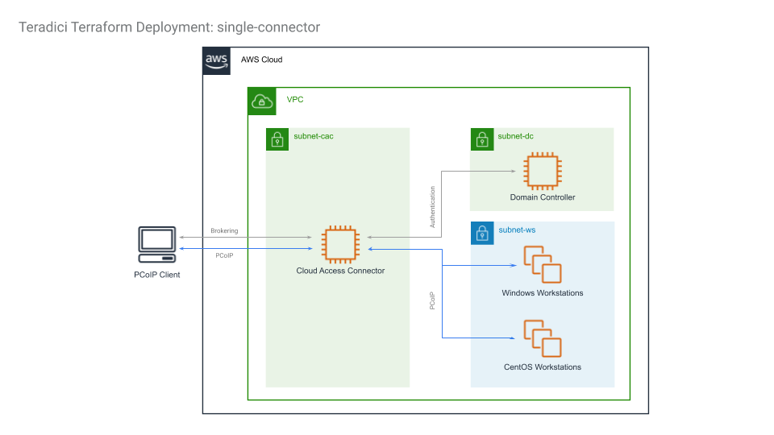
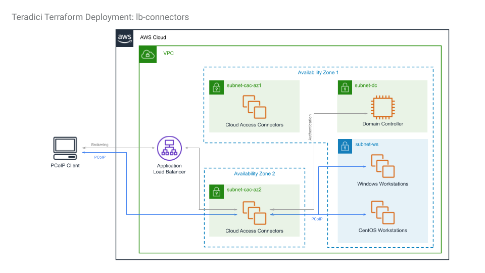
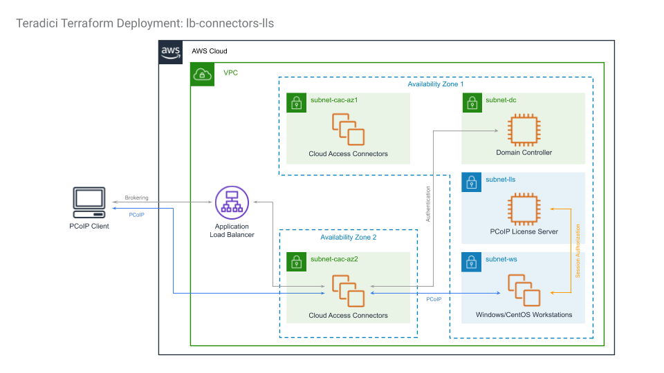

# Amazon Web Services Deployments

## Table of Contents
1. [Getting Started](#getting-started)
    1. [Requirements](#requirements)
    2. [AWS Setup](#aws-setup)
    3. [Cloud Access Manager Setup](#cloud-access-manager-setup)
2. [Running Terraform Scripts](#running-terraform-scripts)
    1. [Customizing terraform.tfvars](#customizing-terraform.tfvars)
    2. [(Optional) Encrypting Secrets](#(optional)-encrypting-secrets)
        1. [Encryption Using Python Script](#encryption-using-python-script)
        2. [Manual Encryption](#manual-encryption)
    3. [Creating the deployment](#creating-the-deployment)
    4. [Add Workstations in Cloud Access Manager](#add-workstations-in-cloud-access-manager)
    5. [Start PCoIP Session](#start-pcoip-session)
    6. [Changing the deployment](#changing-the-deployment)
    7. [Deleting the deployment](#deleting-the-deployment)
3. [Architectures](#architectures)
    1. [single-connector](#single-connector)
    2. [lb-connectors](#lb-connectors)
    3. [lb-connectors-lls](#lb-connectors-lls)
    4. [lb-connectors-ha-lls](#lb-connectors-ha-lls)
4. [Troubleshooting](#troubleshooting)

---

## Getting Started

Before starting, consider watching [this video](https://www.youtube.com/watch?v=hwEOoG4pmMQ) on how to use this repo to deploy a single-connector deployment on AWS from a Windows environment. The video guides the viewer through the entire deployment process from set up to tear down. It also shows how the deployment can be managed through Cloud Access Manager (CAM) and how end-users can connect to their machines using a PCoIP client. While the video shows the single-connector deployment, the process of creating other deployments is very similar. For deployment from a Linux environment, please see the relevant portions of our [GCP video](https://www.youtube.com/watch?v=ESzon04cW4Y).

### Requirements
- the user must have Administrator permissions in an AWS account
- a PCoIP Registration Code is needed. Contact Teradici sales or purchase subscription here: https://www.teradici.com/compare-plans
- a Cloud Access Manager Deployment Service Account is needed. Please see the Cloud Access Manager Setup section below.
- a PCoIP License Server Activation Code is needed for Local License Server (LLS) based deployments.
- an SSH private / public key pair is required for Terraform to log into Linux hosts. Please visit [ssh-key-pair-setup.md](/docs/ssh-key-pair-setup.md) for instructions.
- if SSL is involved, the SSL key and certificate files are needed in PEM format.
- Terraform v0.13.4 or higher must be installed. Please download Terraform from https://www.terraform.io/downloads.html

### AWS Setup
Although it is possible to create deployments in existing and currently in-use accounts, it is recommended to create them in new accounts to reduce chances of name collisions and interfering with operations of existing resources.

With a new AWS account:
- from the AWS console, create a new IAM user with programmatic access and apply the __AdministratorAccess__ policy either by adding the user to a group with such permission, or by attaching the policy to the user directly. Copy the Access key ID and Secret access key into an AWS Credential File as shown below. These credentials are needed by the Terraform scripts to create the initial deployment. Please see https://docs.aws.amazon.com/cli/latest/userguide/cli-configure-files.html for more details on AWS Credential Files.
```
[default]
aws_access_key_id = <your_id>
aws_secret_access_key = <your_key>
```
- in the AWS marketplace portal, visit the Product Overview pages of AMI images that will be used by Terraform scripts. Click on the "Continue to Subscribe" button in the top-right corner of the webpage and subscribe by accepting the terms. Note that only CentOS Standard or Graphics workstations require subscriptions to the AMI images. Visit the following link to subscribe prior to deployment:
    - CentOS Standard or Graphics workstation: https://aws.amazon.com/marketplace/pp/B00O7WM7QW
- (Optional) For better security, create an AWS KMS Customer Managed Symmetric Customer Master Key (CMK) to encrypt secrets.  Please refer to https://docs.aws.amazon.com/kms/latest/developerguide/create-keys.html for instructions to create CMKs.

### Cloud Access Manager Setup
Login to Cloud Access Manager Admin Console at https://cam.teradici.com using a Google G Suite, Google Cloud Identity, or Microsoft business account.

1. create a new deployment using your PCoIP Registration Code. Ignore "Cloud Credentials".
2. on the "Edit the Deployment" page, under "Deployment Service Accounts", click on the + icon to create a CAM Deployment Service Account.
3. click on "Download JSON file" to download the CAM Deployment Service Account credentials file which will be used in terraform.tfvars.

## Running Terraform Scripts

### Customizing terraform.tfvars
terraform.tfvars is the file in which a user specify variables for a deployment. In each deployment, there is a ```terraform.tfvars.sample``` file showing the required variables that a user must provide, along with other commonly used but optional variables. Uncommented lines show required variables, while commented lines show optional variables with their default or sample values. A complete list of available variables are described in the variable definition file ```vars.tf``` of the deployment.

Path variables in terraform.tfvars must be absolute and are dependent on the host platform:
- On Linux systems, the forward slash / is used as the path segment separator. ```aws_credentials_file = "/path/to/aws_key"```
- On Windows systems, the default Windows backslash \ separator must be changed to forward slash as the path segment separator. ```aws_credentials_file = "C:/path/to/aws_key"```

Save ```terraform.tfvars.sample``` as ```terraform.tfvars``` in the same directory, and fill out the required and optional variables.

### (Optional) Encrypting Secrets
terraform.tfvars variables include sensitive information such as Active Directory passwords, PCoIP registration key and the CAM Deployment Service Account credentials file. These secrets are stored in the local files terraform.tfvars and terraform.tfstate, and will also be uploaded as part of provisioning scripts to an AWS S3 bucket.

To enhance security, the Terraform scripts are designed to support both plaintext and KMS-encrypted secrets. Plaintext secrets requires no extra steps, but will be stored in plaintext in the above mentioned locations. It is recommended to encrypt the secrets in the terraform.tfvars file before deploying. Secrets can be encrypted manually first before being entered into terraform.tfvars, or they can be encrypted using a python script located under the tools directory.

#### Encryption Using Python Script
The easiest way to encrypt secrets is to use the kms_secrets_encryption.py Python script under the tools/ directory, which automates the KMS encryption process.

1. ensure the `customer_master_key_id` variable in terraform.tfvars is commented out, as this script will attempt to create the crypto key used to encrypt the secrets:
   ```
   # customer_master_key_id = "<key-id-uuid>"
   ```
2. run the following command inside the tools directory:
   ```
   ./kms_secrets_encryption.py </path/to/terraform.tfvars>
   ```

The script will replace all plaintext secrets inside of terraform.tfvars with ciphertext. Any text files specified under the secrets section as a path will also be encrypted. 

The script can also reverse the encryption by executing it with the '-d' flag. See script's documentation for details (--help).

#### Manual Encryption
To encrypt secrets using the KMS CMK created in the 'AWS Setup' section above, follow the instructions here: https://docs.aws.amazon.com/cli/latest/reference/kms/encrypt.html. Note that ciphertext must be base64 encoded before being used in terraform.tfvars.  

1. create a KMS CMK. Please refer to https://docs.aws.amazon.com/kms/latest/developerguide/create-keys.html for instructions to create keys.
2. in terraform.tfvars, ensure that the `customer_master_key_id` variable is uncommented and is set to the resource path of the KMS key used to encrypt the secrets:
   ```
   customer_master_key_id = "<key-id-uuid>"
   ```
3. run the following command in a Linux shell with aws installed to encrypt a plaintext secret:
   ```
   aws kms encrypt --key-id <cmk-id> --plaintext <secret> --output text --query CiphertextBlob
   ```
   Encrypt and replace the values of the following variables in terraform.tfvars with the ciphertext generated. `<ciphertext`> should be replaced with the actual ciphertext generated - do not include < and >.
   ```
   dc_admin_password           = "<ciphertext>"
   safe_mode_admin_password    = "<ciphertext>"
   ad_service_account_password = "<ciphertext>"
   pcoip_registration_code     = "<ciphertext>"
   ```
4. run the following command in a Linux shell with aws installed to encrypt the CAM Deployment Service Account JSON credentials file:
   ```
    aws kms encrypt \
        --key-id <key-id-uuid> \
        --plaintext fileb://</path/to/cloud-access-manager-service-account.json> \
        --output text \
        --query CiphertextBlob | base64 -d > </path/to/cloud-access-manager-service-account.json.encrypted>
   ```
    Replace the value of the `cam_deployment_sa_file` variable in terraform.tfvars with the absolute path to the encrypted file generated.
   ```
   cam_deployment_sa_file = "/path/to/cloud-access-manager-service-account.json.encrypted"
   ```

The following command can be used to decrypt the ciphertext:
   ```
   aws kms decrypt --ciphertext-blob fileb://<(echo "<ciphertext>" | base64 -d) --output text --query Plaintext | base64 -d
   ```

The following command can be used to decrypt the encrypted CAM Deployment Service Account JSON credentials file:
   ```
   aws kms decrypt --ciphertext-blob fileb://</path/to/cloud-access-manager-service-account.json.encrypted> --output text --query Plaintext | base64 -d > </path/to/cloud-access-manager-service-account.json>
   ```

### Creating the deployment
With the terraform.tfvars file customized
1. run ```terraform init``` to initialize the deployment
2. run ```terraform apply``` to display the resources that will be created by Terraform
3. answer ```yes``` to start creating the deployment
A typical deployment should take 15 to 30 minutes. When finished, the scripts will display a number of values of interest, such as the load balancer IP address. At the end of the deployment, the resources may still take a few minutes to start up completely. Connectors should register themselves with the CAM service and show up in the CAM Admin Console.

### Add Workstations in Cloud Access Manager
Go to the CAM Admin Console and add the newly created workstations using "Add existing remote workstation" in the "Remote Workstations" tab.  Note that it may take a few minutes for the workstation to show up in the "Select workstation from directory" drop-down box.

### Start PCoIP Session
Once the workstations have been added to be managed by CAM and assigned to Active Directory users, a PCoIP user can connect the PCoIP client to the public IP of the Cloud Access Connector or Load Balancer, if one is configured, to start a PCoIP session.

### Changing the deployment
Terraform is a declarative language to describe the desired state of resources. A user can modify terraform.tfvars and run ```terraform apply``` again. Terraform will try to only apply the changes needed to acheive the new state.

Note that changes involving creating or recreating Cloud Access Connectors requires a new connector token from the CAM Admin Console. Create a new connector to obtain a new token.

### Deleting the deployment
Run ```terraform destroy``` to remove all resources created by Terraform.

**Note for the lb-connectors-lls deployment**
Be sure to SSH into the Local License Server (LLS), possibly using a Cloud Access Connector as a jumphost, and run `pcoip-return-online-license -a <activation-code>` before destroying the deployment. Otherwise, the activated PCoIP licenses will be lost.

## Architectures
This section describes the different types of deployment scenarios supported by Terraform scripts in this repository.

### single-connector
This is the simplest deployment; it creates a VPC with 3 subnets in the same region. The subnets are
- ```subnet-dc```: for the Domain Controller
- ```subnet-cac```: for the Connector
- ```subnet-ws```: for the workstations

```subnet-cac``` is a public subnet because this is where PCoIP clients connect from the public networks.  ```subnet-dc``` is ideally in a private subnet, but is made public to provide progress feedback during Terraform deployment and ease of access for debug purposes.  ```subnet-ws``` is a private subnet where workstations are deployed. Workstations have access to the internet vai a NAT gateway.

Security Group rules are created to allow wide-open access within the VPC, and selected ports are open to the public for operation and for debug purposes.

A Domain Controller is created with Active Directory, DNS and LDAP-S configured. 2 Domain Admins are set up in the new domain: ```Administrator``` and ```cam_admin``` (default). Domain Users are also created if a ```domain_users_list``` CSV file is specified. The Domain Controller is given a static IP (configurable).

A Cloud Access Connector is created and registers itself with the CAM service with the given CAM Deployment Service Account credentials and PCoIP Registration code.

Domain-joined workstations are optionally created, specified by the following parameters:
- ```win_gfx_instance_count```: Windows Graphics workstation,
- ```win_std_instance_count```: Windows Standard workstation,
- ```centos_gfx_instance_count```: CentOS Graphics workstation, and
- ```centos_std_instance_count```: CentOS Standard workstation.

These workstations are automatically domain-joined and have the PCoIP Agent installed.  For graphics workstations, NVidia graphics driver are also installed.



### lb-connectors
The difference between [single-connector](#single-connector) and lb-connectors deployments is that instead of creating only one Cloud Access Connector, the lb-connectors deployment creates a group of Cloud Access Connectors in two or more availability zones (AZs) within an AWS region behind an AWS Application Load Balancer (ALB). In this setup, a client initiates a PCoIP session with the public DNS name of the ALB, and the ALB will select one of the Cloud Access Connectors to establish the PCoIP connection. In-session PCoIP traffic goes through the selected Cloud Access Connector directly, bypassing the ALB.

The AZs and number of Cloud Access Connectors for each AZs are specified by the ```cac_zone_list``` and ```cac_instance_count_list``` variables, respectively. At least two AZ and one Cloud Access Connector instance must be specified.

The following diagram shows what a lb-connectors deployment looks like with 2 AZs specified:



### lb-connectors-lls
This deployment is similar to the [lb-connectors](#lb-connectors) deployment, except the workstations will use a PCoIP License Server, also known as a Local License Server (LLS), to obtain PCoIP licenses instead of reaching out to the internet to validate the PCoIP Registration Code witha Cloud License Server (CLS) when establishing a PCoIP session. To use this deployment, a user must supply an Activation Code which is used by the LLS to "check out" PCoIP licenses, in addition to a PCoIP registration code.

**Note when destroying this deployment**
Be sure to SSH into the Local License Server (LLS), possibly using a Cloud Access Connector as a jumphost, and run `pcoip-return-online-license -a <activation-code>` before destroying the deployment. Otherwise, the "checked out" PCoIP licenses will be lost.

For more information on the LLS, please visit https://www.teradici.com/web-help/pcoip_license_server/current/online/



### lb-connectors-ha-lls
This deployment is the same as [lb-connectors-lls](#lb-connectors-lls), except for the LLS component where it is now implemented as a highly available LLS subsystem. Instead of running in a single EC2 instance deployed in the ```subnet-lls``` subnet, there are now a Main and a Backup LLS, along with an HAProxy pair running keepalived, to ensure PCoIP Licenses continue to be served should any one of the EC2 instances in the LLS subsystem fails. During normal operation, the main LLS periodically synchronizes its database to the backup LLS. This synchronization is unidirectional; the backup LLS does not synchronize back to the main LLS.

**Failover Behavior**
The LLS Failover documentation [here](https://www.teradici.com/web-help/pcoip_license_server/current/online/documentation/using-failover/) explains that PCoIP agents do not automatically switch to the backup LLS when the main LLS fails. However, this is not the case with this aws-lb-connectors-ha-lls AWS deployment - the HAProxy is configured for automatic failover to the backup LLS when the main LLS fails. However, HAProxy is also purposefully configured not to failback to the main LLS when it comes back online after a failure; the switchover from backup to main LLS must be done manually by restarting both HAProxy servers. This is done so that the failback can happen at a scheduled time to ensure the LLS databases of both LLS servers are properly synchronized.

**Note when destroying this deployment**
Be sure to SSH into the main LLS, possibly using a Cloud Access Connector as a jumphost, and run `pcoip-return-online-license -a <activation-code>` before destroying the deployment. Otherwise, the "checked out" PCoIP licenses will be lost. This only needs to be performed on the main LLS and not on the backup LLS.

For more information on setting up a Failover LLS, please visit https://www.teradici.com/web-help/pcoip_license_server/current/online/documentation/using-failover/

The following diagram shows the LLS subsystem in ```subnet-lls``` that replaces the single EC2 instance in the [lb-connectors-lls](#lb-connectors-lls) deployment.


## Troubleshooting
Please visit the [Troubleshooting](/docs/troubleshooting.md) page for further instructions.
