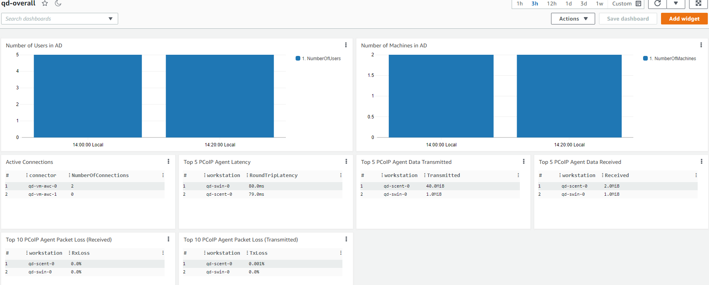
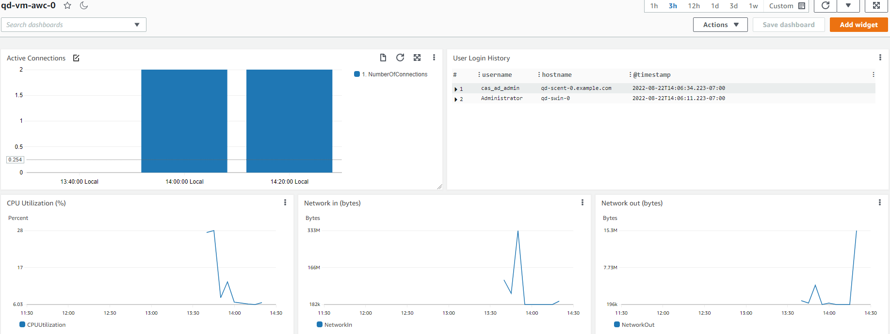
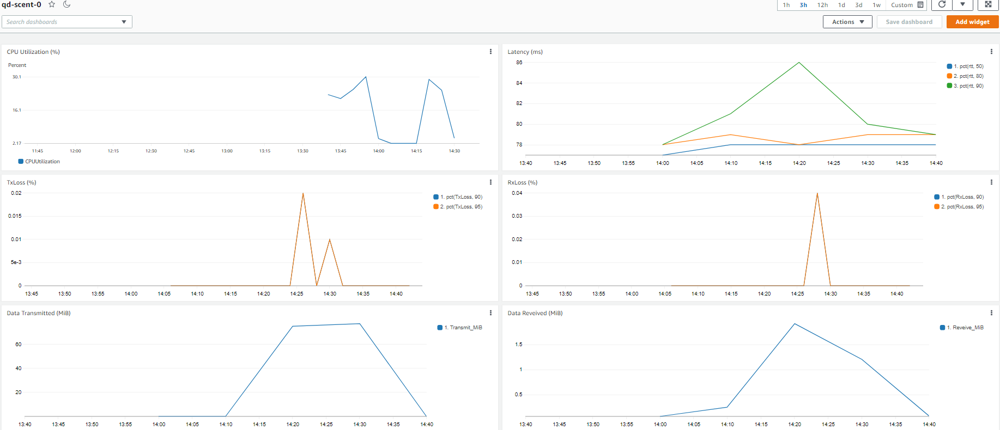

# Amazon Web Services Deployments

## Table of Contents
- [Amazon Web Services Deployments](#amazon-web-services-deployments)
  - [Table of Contents](#table-of-contents)
  - [Introduction](#introduction)
  - [AWS Quickstart](#aws-quickstart)
  - [Manual Terraform Configuration](#manual-terraform-configuration)
    - [Requirements](#requirements)
    - [Selecting a Deployment](#selecting-a-deployment)
    - [AWS Setup](#aws-setup)
    - [Anyware Manager as a Service Setup](#awm-as-a-service-setup)
    - [Customizing terraform.tfvars](#customizing-terraformtfvars)
      - [Workstation IdleShutDown](#workstation-idleshutdown)
    - [Creating the deployment](#creating-the-deployment)
    - [Add Workstations in Anyware Manager](#add-workstations-in-awm)
    - [Start PCoIP Session](#start-pcoip-session)
    - [Changing the deployment](#changing-the-deployment)
    - [Deleting the deployment](#deleting-the-deployment)
  - [Optional AWS Service Integrations](#optional-aws-service-integrations)
    - [AWS Cloudwatch](#aws-cloudwatch)
      - [AWS CloudWatch Dashboard](#aws-cloudwatch-dashboard)
    - [AWS Session Manager](#aws-session-manager)
  - [Troubleshooting](#troubleshooting)

---

## Introduction

There are two ways to create a HP Anyware deployment using this repository:
- [__AWS Quickstart__](#aws-quickstart): for those who have less experience with the CLI and Terraform, use this to get a deployment running with the least amount of effort. The quickstart will prepare most of the requirements for the user and call a script to deploy the _single-connector_ deployment using Terraform.
- [__Manual Terraform Configuration__](#manual-terraform-configuration): for those who are experienced with the CLI and Terraform, this is the primary way this repository is meant to be used. A user can choose between different types of deployments, variables can be customized, and deployment architecture can be modified to suit the user's needs.

## AWS Quickstart

The quickest way to create a reference deployment on AWS is to run the Quickstart Python script in the AWS CloudShell or your local CLI. The goal is to automate the creation of a [single-connector deployment](deployments.md#single-connector) as much as possible by using auto-generated values for required parameters.

To go to the AWS Quickstart directory, click [here](/quickstart/aws/)

### Requirements
#### Required permissions for the AWS account used in Terraform deployment
- Option 1: Administrator Permissions
     - The user needs to have Administrator permissions in the AWS account.
     - This allows full access to all AWS services and resources within the account.
  
- Option 2: Specific Permissions using AWS Managed Roles  
      To execute Terraform deployment, the AWS account used should have the following roles attached:
    - AmazonEC2FullAccess
    - AmazonRoute53ResolverFullAccess
    - AmazonS3FullAccess
    - AmazonSNSFullAccess
    - AWSCertificateManagerFullAccess
    - AWSKeyManagementServicePowerUser
    - CloudWatchLogsFullAccess
    - IAMFullAccess

 - Option 3: Custom Policy
      - Users can associate a custom policy to the AWS account using the provided [Sample Policy](/docs/aws/SamplePolicy.json) here.
      
Options 2 and 3 are recommended for users who prefer a more granular approach, granting only the necessary permissions for the Terraform deployment to minimize potential security risks. The custom policy imposes stricter restrictions when compared to the group of AWS-managed roles, ensuring limited access.
 
- a PCoIP Registration Code is needed. Contact Teradici sales or purchase subscription here: https://www.teradici.com/compare-plans
- the user must have Python installed. Please see [Download Python](https://www.python.org/downloads/) for instructions. 
- the user must have AWS CLI installed and configured if running Quickstart script in local CLI. Please visit [AWS CLI Installation](https://docs.aws.amazon.com/cli/latest/userguide/getting-started-install.html) and [AWS CLI Configuration](https://docs.aws.amazon.com/cli/latest/userguide/cli-chap-configure.html) for instructions.

## Manual Terraform Configuration

Before starting, consider watching [this video](https://www.youtube.com/watch?v=hwEOoG4pmMQ) on how to use this repo to deploy a single-connector deployment on AWS from a Windows environment. The video guides the viewer through the entire deployment process from set up to tear down. It also shows how the deployment can be managed through Anyware Manager as a Service (AWM-S) and how end-users can connect to their machines using a PCoIP client. While the video shows the single-connector deployment, the process of creating other deployments is very similar. For deployment from a Linux environment, please see the relevant portions of our [GCP video](https://www.youtube.com/watch?v=ESzon04cW4Y). Note that since this repository is constantly being updated, there might be minor differences between what is shown in the video compared to the latest version on GitHub.

### Requirements
#### Required permissions for the AWS account used in Terraform deployment
- Option 1: Administrator Permissions
     - The user needs to have Administrator permissions in the AWS account.
     - This allows full access to all AWS services and resources within the account.
  
- Option 2: Specific Permissions using AWS Managed Roles  
      To execute Terraform deployment, the AWS account used should have the following roles attached:
    - AmazonEC2FullAccess
    - AmazonRoute53ResolverFullAccess
    - AmazonS3FullAccess
    - AmazonSNSFullAccess
    - AWSCertificateManagerFullAccess
    - CloudWatchLogsFullAccess
    - IAMFullAccess
    - SecretsManagerReadWrite

 - Option 3: Custom Policy
     - Users can associate a custom policy to the AWS account using the provided [Sample Policy](/docs/aws/SamplePolicy.json) here.
      
Options 2 and 3 are recommended for users who prefer a more granular approach, granting only the necessary permissions for the Terraform deployment to minimize potential security risks. The custom policy imposes stricter restrictions when compared to the group of AWS-managed roles, ensuring limited access.

- a PCoIP Registration Code is needed. Contact Teradici sales or purchase subscription here: https://www.teradici.com/compare-plans
- for HP Anyware deployments using PCoIP License Server, an activation code with PCoIP session licenses is needed.
- for deployments using Anyware Manager as a Service, a Anyware Manager Deployment Service Account is needed. Please see the [Anyware Manager as a Service Setup](#awm-as-a-service-setup) section below.
- an SSH private / public key pair is required for Terraform to log into Linux hosts. Please visit [ssh-key-pair-setup.md](/docs/ssh-key-pair-setup.md) for instructions.
- if custom TLS key and certificates are required, the TLS key and certificate files are needed in PEM format.
- Terraform v1.0 or higher must be installed. Please download Terraform from https://www.terraform.io/downloads.html

### Selecting a Deployment
This repository contains Terraform configurations for a number of different HP Anyware deployment types. Please see the the [Deployments](deployments.md) page for a more detailed description of the various deployments.

### AWS Setup
Although it is possible to create deployments in existing and currently in-use accounts, it is recommended to create them in new accounts to reduce chances of name collisions and interfering with operations of existing resources.

With a new AWS account:
- from the AWS console, create a new IAM user with programmatic access and apply the __AdministratorAccess__ policy either by adding the user to a group with such permission, or by attaching the policy to the user directly. Copy the Access key ID and Secret access key into an AWS Credential File as shown below. These credentials are needed by the Terraform configurations to create the initial deployment. Please see https://docs.aws.amazon.com/cli/latest/userguide/cli-configure-files.html for more details on AWS Credential Files.
```
[default]
aws_access_key_id = <your_id>
aws_secret_access_key = <your_key>
```
### Anyware Manager as a Service Setup
(for deployments using the Anyware Manager as a Service only)

Follow the steps below to set up a Anyware Manager deployment and download Anyware Manager Deployment Service Acccount credentials. For deployments using Anyware Manager running in a virtual machine, these steps can be skipped because the Terraform configuration will automatically set those up for the user.

1. Login to Anyware Manager Admin Console at https://cas.teradici.com using a Google Workspace, Google Cloud Identity, or Microsoft business account.
2. Create a new deployment with your PCoIP registration code.
4. Select `Edit deployment`, select the `CLOUD SERVICE ACCOUNTS` tab, and follow the instructions to add your AWS account.
5. Select `Edit deployment`, select the `DEPLOYMENT SERVICE ACCOUNTS` tab, click on the + icon to create a Anyware Manager Deployment Service Account.
6. Click on `DOWNLOAD JSON FILE` to download the Anyware Manager Deployment Service Account credentials file, which will be used in `terraform.tfvars`.

### Customizing terraform.tfvars
`terraform.tfvars` is the file in which a user specify variables for a deployment. In each deployment, there is a `terraform.tfvars.sample` file showing the required variables that a user must provide, along with other commonly used but optional variables. Uncommented lines show required variables, while commented lines (those beginning with `#`) show optional variables with their default or sample values. A complete list of available variables are described in the variable definition file `vars.tf` of the deployment.

Path variables in `terraform.tfvars` must be absolute and are dependent on the host platform:
- On Linux systems, the forward slash / is used as the path segment separator. `aws_credentials_file = "/path/to/aws_key"`
- On Windows systems, the default Windows backslash \ separator must be changed to forward slash as the path segment separator. `aws_credentials_file = "C:/path/to/aws_key"`

Save `terraform.tfvars.sample` as `terraform.tfvars` in the same directory, and fill out the required and optional variables.

#### Workstation IdleShutDown
Workstations created by Terraform have IdleShutDown Agent enabled by default so that the remote workstation will shutdown when it is idle. The default settings can be changed by specifying the `idle_shutdown_enable` (default: `true`), `idle_shutdown_minutes_idle_before_shutdown` (default: `240`), and `idle_shutdown_polling_interval_minutes` (default: `15`) variables in `terraform.tfvars`. Learn more about IdleShutDown [here](https://www.teradici.com/web-help/anyware_manager/22.09/admin_console/workstation_pools/#idle-shutdown-service).

### Creating the deployment
With `terraform.tfvars` customized

1. run `terraform init` to initialize the deployment
2. run `terraform apply` to display the resources that will be created by Terraform
3. answer `yes` to start creating the deployment

A typical deployment should take 15 to 30 minutes. When finished, Terraform will display a number of values of interest, such as the load balancer IP address. At the end of the deployment, the resources may still take a few minutes to start up completely. Anyware Connectors (AWCs) should register themselves with Anyware Manager and show up in the Admin Console in Anyware Manager.

**Security Note**: The Domain Controller has been assigned a public IP address by default, so that Terraform can show the progress of setting up the Domain Controller. Access to this public IP address is limited by AWS security groups to the IP address of the Terraform host and any IP addresses specified in the `allowed_admin_cidrs` variable in `terraform.tfvars`. It is recommended that access to the Domain Controller is reviewed and modified to align with the security policies of the user.     

**Note**: If Terraform returns the error "An argument named `sensitive` is not expected here." this means that the Terraform version installed does not meet the requirements. Please see [here](#manual-terraform-configuration) and make sure you have fulfilled all the requirements.

### Add Workstations in Anyware Manager
Go to the Anyware Manager Admin Console and add the newly created workstations using "Add existing remote workstation" in the "Remote Workstations" tab.  Note that it may take a few minutes for the workstation to show up in the "Select workstation from directory" drop-down box.

### Start PCoIP Session
Once the workstations have been added to be managed by Anyware Manager and assigned to Active Directory users, a PCoIP user can connect the PCoIP client to the public IP of the Anyware Connector or Load Balancer, if one is configured, to start a PCoIP session.

### Changing the deployment
Terraform is a declarative language to describe the desired state of resources. A user can modify `terraform.tfvars` and run `terraform apply` again, and Terraform will try to only apply the changes needed to acheive the new state.

### Deleting the deployment
Run `terraform destroy` to remove all resources created by Terraform.

**Note for deployments using the PCoIP License Server (all deployments with names ending in "lls")**
Be sure to SSH into the PCoIP License Server (LLS), possibly using a Anyware Connector as a jumphost, and run `pcoip-return-online-license -a <activation-code>` before destroying the deployment. Otherwise, the activated PCoIP licenses will be lost.

For more information on the LLS, please visit https://www.teradici.com/web-help/pcoip_license_server/current/online/

## Optional AWS Service Integrations

### AWS CloudWatch
CloudWatch is a monitoring and management service that provides data and actionable insights for AWS, hybrid, and on-premises applications and infrastructure resources. For more information, please visit https://aws.amazon.com/cloudwatch/

When CloudWatch is enabled, CloudWatch agent will be installed and configured on each instance to upload and stream logs that can be used for troubleshooting. Please visit the [Troubleshooting](/docs/troubleshooting.md) page for a list of logs that would upload to CloudWatch. The selected logs can be found in `Log groups` in the CloudWatch navigation pane. 

CloudWatch is enabled by default to provide better experience of accessing the logs. It can be disabled by adding `cloudwatch_enable = false` to `terraform.tfvars` before running `terraform apply`. 

#### AWS CloudWatch Dashboard
Amazon CloudWatch dashboards are customizable home pages in the CloudWatch console that can be used to monitor the resources in a single view. For more information, please visit https://docs.aws.amazon.com/AmazonCloudWatch/latest/monitoring/CloudWatch_Dashboards.html 

When CloudWatch is enabled, Terraform will create one overall dashboard for the deployment, one dashboard for each Anyware Connector, and one dashboard for each workstation. Each dashboard contains queries that fetch the logs and data from the corresponding `Log groups`. The dashboards can be found in `Dashboard` in the CloudWatch navigation pane. 

The overall dashboard provides high level graphs including:
- `Number of users in AD`: Reports number of users in AD. Users in AD cannot be removed by Terraform. Users have to connect to DC to remove the users. 
- `Number of machines in AD`: Repots number of machines in AD. Machines in AD cannot be removed by Terraform. Users have to connect to DC to remove the machines. 
- `Active Connections`: Reports number of active connections in each Anyware Connector. 
- `Top 5 PCoIP Agent Latency`: Reports the Workstation sessions with the 5 longest average Round Trip Times calculated over the measurement period. 
- `Top 5 PCoIP Agent Data Transmitted`: Reports the top 5 Workstations volume of transmit data transfered (Host Workstation to Client MebiByte) during the measurement period. 
- `Top 5 PCoIP Agent Data Received`: Reports the top 5 Workstations volume of receive data transfered (Client to Host Workstation MebiByte) during the measurement period.
- `Top 10 PCoIP Agent Packet Loss (Transmitted)`: Reports the Workstations experiencing the 10 worst transmit (Host Workstation to Client) packet loss intervals during the measurement period. 
- `Top 10 PCoIP Agent Packet Loss (Received)`: Reports the Workstations experiencing the 10 worst receive (Client to Host Workstation) packet loss intervals during the measurement period. 



The Anyware Connector dashboard includes 2 graphs:
- `Active Connections`: Reports number of active connections over the measurement period. 
- `User Login History`: Reports time, workstation, and username of connections over the measurement period. 
- `CPU Utilization`: Reports the percentage of allocated EC2 compute units that are currently in use on the instance.
- `Network In`: Reports the number of bytes received by the instance on all network interfaces.
- `Network Out`: Reports the number of bytes sent out by the instance on all network interfaces.



The workstation dashboard shows workstation relevant data such as:
- `CPU Utilization`: Reports the percentage of allocated EC2 compute units that are currently in use on the instance.
- `Latency (ms)`: Reports 50th, 80th and 90th percentile Round Trip Times across all logged PCoIP sessions over the measurement period. 
- `TxLoss (%)`: Reports 90th and 95th percentile of transmit (Host Workstation to Client) packet loss of the workstation.
- `RxLoss (%)`: Reports 90th and 95th percentile of receive (Client to Host Workstation) packet loss of the workstation.
- `Data Transmitted (MiB)`: Reports volume of transmit data transfered (Host Workstation to Client MebiByte) during the measurement period. 
- `Data Reveived (MiB)`: Reports volume of receive data transfered (Client to Host Workstation MebiByte) during the measurement period. 



### AWS Session Manager
Session Manager is an AWS Systems Manager capability that can be used to connect to instances using either an interactive one-click browser-based shell or AWS Command Line Interface. For more information, please visit https://docs.aws.amazon.com/systems-manager/latest/userguide/session-manager.html

When Session Manager is enabled, Terraform adds the minimal permission to IAM roles used by EC2 instances. This allows Administrators to establish SSH and RDP connections with Admin access even when a EC2 instance doesn't have a public IP address.

Session Manager is enabled by default to allow Administrators to connect to instances easily. It can be disabled by adding `aws_ssm_enable = false` to `terraform.tfvars` before running `terraform apply`.

## Troubleshooting
Please visit the [Troubleshooting](/docs/troubleshooting.md) page for further instructions.
