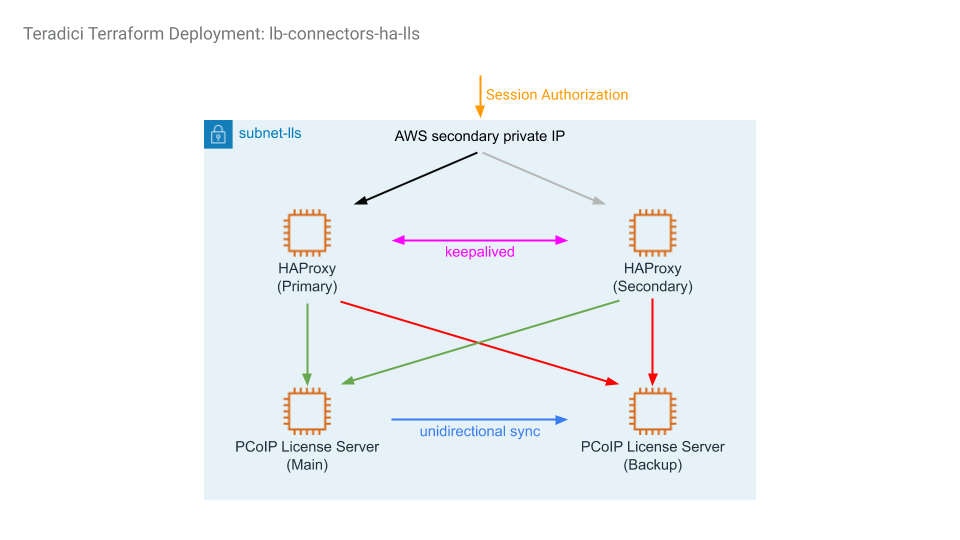

# AWS Deployment Types

## Table of Contents

- [Overview](#overview)
- [single-connector](#single-connector)
- [awm-single-connector](#awm-single-connector)
- [lb-connectors](#lb-connectors)
- [awm-lb-connectors](#awm-lb-connectors)
- [lb-connectors-lls](#lb-connectors-lls)
- [awm-lb-connectors-lls](#awm-lb-connectors-lls)
- [lb-connectors-ha-lls](#lb-connectors-ha-lls)
- [awm-lb-connectors-ha-lls](#awm-lb-connectors-ha-lls)

---

## Overview

This repository contains a number of HP Anyware deployment architectures on AWS. The tables below compare major differences between the deployments. Note that the deployments in the second table are essentially the same as those in the first table; the difference between them is how each HP Anyware deployment is managed:
1. using Anyware Manager as a Service, which is a SaaS run by Teradici (first table), or
2. running the Anyware Manager in a virtual machine that a user controls in his or her own HP Anyware deployment (second table)

Using Anyware Manager as a Service run by Teradici allows a user to rely on Teradici for running and maintaining the Anyware Manager without additional costs. Running the Anyware Manager in a virtual machine, on the other hand, gives the user full control of the HP Anyware deployment; the HP Anyware deployment will not have to reach out to the internet for HP Anyware management features, but the user is responsible for costs, security, updates, high availability and maintenance of the virtual machine running Anyware Manager.

| | single-connector | lb-connectors | lb-connectors-lls | lb-connectors-ha-lls |
| --- | --- | --- | --- | --- |
| Description | Great for quick proof of concept. Only has one Connector in one region, limiting scalability.  | Supports multiple Connectors in multiple Availability Zones (AZ) within a region, running behind an Application Load Balancer. PCoIP clients can access the deployment via either the load balancer or public IP addresses of the Connectors. | Similar to lb-connectors, but uses PCoIP License Server instead of Cloud License Server | Similar to lb-connectors-lls, except a pair of main and backup PCoIP License Servers are deployed for high availability. |
| # of Connectors | 1 | 1 or more per AZ | 1 or more per AZ | 1 or more per AZ |
| # of AZ for Connectors | 1 | 2 or more | 2 or more | 2 or more |
| # of AZ for Workstations | 1 | 1 | 1 | 1 |
| # of PCoIP Entry Points | 1 (single Virtual Machine) | Multiple (Application Load Balancer and public IP of Connectors) | Multiple (Application Load Balancer and public IP of Connectors) | Multiple (Application Load Balancer and public IP of Connectors) |
| Licensing | Cloud License Server | Cloud License Server | PCoIP License Server | PCoIP License Server (Highly Available) |
| Anyware Manager | as a Service | as a Service | as a Service | as a Service |

| | awm-single-connector | awm-lb-connectors | awm-lb-connectors-lls | awm-lb-connectors-ha-lls |
| --- | --- | --- | --- | --- |
| Description | Great for quick proof of concept. Only has one Connector in one region, limiting scalability.  | Supports multiple Connectors in multiple Availability Zones (AZ) within a region, running behind an Application Load Balancer. PCoIP clients can access the deployment via either the load balancer or public IP addresses of the Connectors. | Similar to lb-connectors, but uses PCoIP License Server instead of Cloud License Server | Similar to lb-connectors-lls, except a pair of main and backup PCoIP License Servers are deployed for high availability. |
| # of Connectors | 1 | 1 or more per AZ | 1 or more per AZ | 1 or more per AZ |
| # of AZ for Connectors | 1 | 2 or more | 2 or more | 2 or more |
| # of AZ for Workstations | 1 | 1 | 1 | 1 |
| # of PCoIP Entry Points | 1 (single Virtual Machine) | Multiple (Application Load Balancer and public IP of Connectors) | Multiple (Application Load Balancer and public IP of Connectors) | Multiple (Application Load Balancer and public IP of Connectors) |
| Licensing | Cloud License Server | Cloud License Server | PCoIP License Server | PCoIP License Server (Highly Available) |
| Anyware Manager | Virtual Machine | Virtual Machine | Virtual Machine | Virtual Machine |

## single-connector

This is the simplest deployment; it creates a VPC with 3 subnets in the same region. The subnets are
- `subnet-dc`: for the Domain Controller
- `subnet-cac`: for the Connector
- `subnet-ws`: for the workstations

`subnet-cac` is a public subnet because this is where PCoIP clients connect from the public networks. `subnet-dc` is ideally in a private subnet, but is made public to provide progress feedback during Terraform deployment and ease of access for debug purposes. `subnet-ws` is a private subnet where workstations are deployed. Workstations have access to the internet via a NAT gateway.

Security Group rules are created to allow wide-open access within the VPC, and selected ports are open to the public for operation and for debug purposes.

A Domain Controller is created with Active Directory, DNS and LDAP-S configured. 2 Domain Admins are set up in the new domain: `Administrator` and `anyware_ad_admin` (default). Domain Users are also created if a `domain_users_list` CSV file is specified. The Domain Controller is given a static IP and a public IP.

A Cloud Access Connector is created and registers itself with Anyware Manager as a Service with the given Anyware Manager Deployment Service Account credentials.

Domain-joined workstations are optionally created, specified by the following parameters:
- `win_gfx_instance_count`:    Windows Graphics workstation
- `win_std_instance_count`:    Windows Standard workstation
- `centos_gfx_instance_count`: CentOS Graphics workstation
- `centos_std_instance_count`: CentOS Standard workstation

These workstations are automatically domain-joined and have the PCoIP Agent installed.  For graphics workstations, NVidia graphics driver is also installed.

## awm-single-connector

This deployment is essentially the same as [single-connector](#single-connector), except instead of using Anyware Manager as a Service provided by Teradici, the HP Anyware deployment is managed by Anyware Manager installed in a virtual machine in the `subnet-awm` subnet.

## lb-connectors

The difference between [single-connector](#single-connector) and lb-connectors deployments is that instead of creating only one Cloud Access Connector, the lb-connectors deployment creates a group of Cloud Access Connectors in two or more availability zones (AZs) within an AWS region behind an AWS Application Load Balancer (ALB). In this setup, a client initiates a PCoIP session with the public DNS name of the ALB, and the ALB will select one of the Cloud Access Connectors to establish the PCoIP connection. In-session PCoIP traffic goes through the selected Cloud Access Connector directly, bypassing the ALB.

The AZs and number of Cloud Access Connectors for each AZs are specified by the `cac_zone_list` and `cac_instance_count_list` variables, respectively. At least two AZ and one Cloud Access Connector instance must be specified.

The following diagram shows what a lb-connectors deployment looks like with 2 AZs specified:

## awm-lb-connectors

This deployment is essentially the same as [lb-connectors](#lb-connectors), except instead of using Anyware Manager as a Service provided by Teradici, the HP Anyware deployment is managed by Anyware Manager installed in a virtual machine in the `subnet-awm` subnet.

## lb-connectors-lls

This deployment is similar to the [lb-connectors](#lb-connectors) deployment, except the workstations will use a PCoIP License Server, also known as a Local License Server (LLS), to obtain PCoIP licenses instead of reaching out to the internet to validate the PCoIP Registration Code with a Cloud License Server (CLS) when establishing a PCoIP session. To use this deployment, a user must supply an Activation Code which is used by the LLS to "check out" PCoIP licenses, in addition to a PCoIP registration code.

**Note when destroying this deployment**
Be sure to SSH into the Local License Server (LLS) by using a Cloud Access Connector as a jumphost and run `pcoip-return-online-license -a <activation-code>` before destroying the deployment. Otherwise, the "checked out" PCoIP licenses will be lost.

For more information on the LLS, please visit https://www.teradici.com/web-help/pcoip_license_server/current/online/

## awm-lb-connectors-lls

This deployment is essentially the same as [lb-connectors-lls](#lb-connectors-lls), except instead of using Anyware Manager as a Service provided by Teradici, the HP Anyware deployment is managed by Anyware Manager installed in a virtual machine in the `subnet-awm` subnet.

## lb-connectors-ha-lls

This deployment is the same as [lb-connectors-lls](#lb-connectors-lls), except the LLS is implemented as a highly available LLS subsystem. Instead of running in a single EC2 instance deployed in the `subnet-lls` subnet, there are now a Main and a Backup LLS, along with an HAProxy pair running keepalived, to ensure PCoIP Licenses continue to be served should any one of the EC2 instances in the LLS subsystem fails. During normal operation, the main LLS periodically synchronizes its database to the backup LLS. This synchronization is unidirectional; the backup LLS does not synchronize back to the main LLS.

**Failover Behavior**
The LLS Failover documentation [here](https://www.teradici.com/web-help/pcoip_license_server/current/online/documentation/using-failover/) explains that PCoIP agents do not automatically switch to the backup LLS when the main LLS fails. However, this is not the case with this lb-connectors-ha-lls AWS deployment - the HAProxy is configured for automatic failover to the backup LLS when the main LLS fails. However, HAProxy is also purposefully configured not to failback to the main LLS when it comes back online after a failure; the switchover from backup to main LLS must be done manually by restarting both HAProxy servers. This is done so that the failback can happen at a scheduled time to ensure the LLS databases of both LLS servers are properly synchronized.

**Note when destroying this deployment**
Be sure to SSH into the main LLS by using a Cloud Access Connector as a jumphost and run `pcoip-return-online-license -a <activation-code>` before destroying the deployment. Otherwise, the "checked out" PCoIP licenses will be lost. This only needs to be performed on the main LLS and not on the backup LLS.

For more information on setting up a Failover LLS, please visit https://www.teradici.com/web-help/pcoip_license_server/current/online/documentation/using-failover/

The following diagram shows the LLS subsystem in `subnet-lls` that replaces the single EC2 instance in the [lb-connectors-lls](#lb-connectors-lls) deployment.

## awm-lb-connectors-ha-lls

This deployment is essentially the same as [lb-connectors-ha-lls](#lb-connectors-ha-lls), except instead of using Anyware Manager as a Service provided by Teradici, the HP Anyware deployment is managed by Anyware Manager installed in a virtual machine in the `subnet-awm` subnet.
