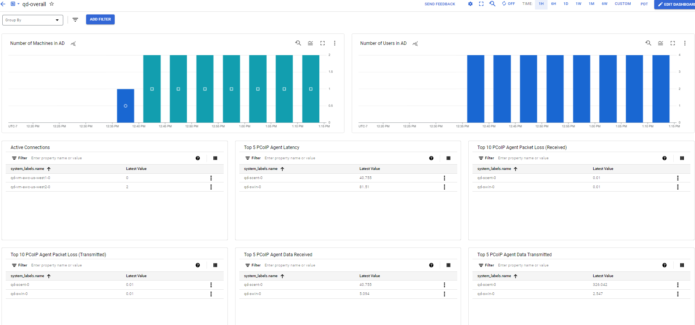
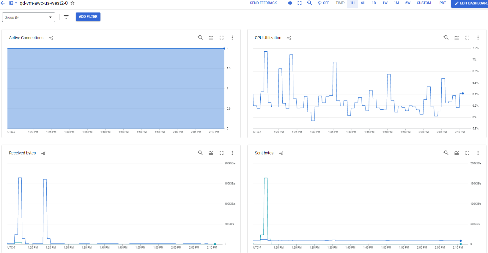
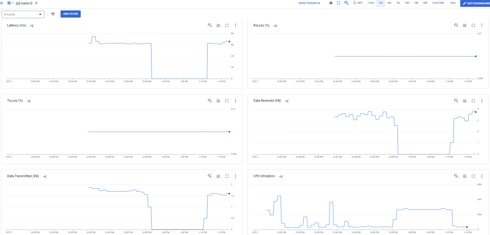

# Google Cloud Platform Deployments

## Table of Contents
- [Google Cloud Platform Deployments](#google-cloud-platform-deployments)
  - [Table of Contents](#table-of-contents)
  - [Introduction](#introduction)
  - [GCP Quickstart Tutorial](#gcp-quickstart-tutorial)
  - [Manual Terraform Configuration](#manual-terraform-configuration)
    - [Requirements](#requirements)
    - [Selecting a Deployment](#selecting-a-deployment)
    - [GCP Setup](#gcp-setup)
    - [Anyware Manager as a Service Setup](#awm-as-a-service-setup)
    - [Customizing terraform.tfvars](#customizing-terraformtfvars)
      - [Workstation IdleShutDown](#workstation-idleshutdown)
    - [Creating the deployment](#creating-the-deployment)
    - [Add Workstations in Anyware Manager](#add-workstations-in-awm)
    - [Start PCoIP Session](#start-pcoip-session)
    - [Changing the deployment](#changing-the-deployment)
    - [Deleting the deployment](#deleting-the-deployment)
  - [Optional GCP Service Integrations](#optional-gcp-service-integrations)
    - [GCP Cloud Logging and Monitoring](#gcp-cloud-logging-and-monitoring)
      - [GCP Cloud Logging](#gcp-cloud-logging)
      - [GCP Cloud Monitoring](#gcp-cloud-monitoring)
    - [GCP Identity-Aware Proxy (IAP)](#gcp-identity-aware-proxy-iap)
  - [Troubleshooting](#troubleshooting)

---

## Introduction

There are two ways to create a HP Anyware deployment using this repository:
- [__GCP Quickstart Tutorial__](#gcp-quickstart-tutorial): for those who have less experience with the Command Line Interface (CLI) and Terraform, use this tutorial to get a deployment running with the least amount of effort by using the [Google Cloud Shell](https://cloud.google.com/shell). The quickstart will prepare most of the requirements for the user and call a script to deploy the _single-connector_ deployment using Terraform.
- [__Manual Terraform Configuration__](#manual-terraform-configuration): for those who are experienced with the CLI and Terraform, this is the primary way this repository is meant to be used. A user can choose between different types of deployments, variables can be customized, and deployment architecture can be modified to suit the user's needs.

## GCP Quickstart Tutorial

The quickest way to create a reference deployment on GCP is to run the Quickstart Python script in the Google Cloud Shell. The goal is to automate the creation of a [single-connector deployment](deployments.md#single-connector) as much as possible by using auto-generated values for required parameters.

Click on the button below to clone this repository in your GCP Cloud Shell and launch the tutorial. The tutorial can be found on the panel to the right once the GCP Cloud Shell opens. 

The following videos are also available to guide the viewer through the GCP Quickstart deployment process.
- [Cloud Deployment Scripts Overview and Introduction](https://youtu.be/ZIwrdf6xRl4)
- [Deploying HP Anyware on GCP Using the GCP Quickstart Script](https://youtu.be/GA-dZ0AWxOw)
- [Connecting to HP Anyware Workstations](https://youtu.be/wodU8xZlZWM)
- [Cleaning Up GCP HP Anyware Deployment](https://youtu.be/7todYnvRsls)

## Manual Terraform Configuration

Before starting, consider watching [this video](https://www.youtube.com/watch?v=ESzon04cW4Y) on how to use this repo to deploy a single-connector deployment on GCP from a Linux environment. The video guides the viewer through the entire deployment process from set up to tear down. It also shows how the deployment can be managed through Anyware Manager as a Service (AWM-S) and how end-users can connect to their machines using a PCoIP client. While the video shows the single-connector deployment, the process of creating other deployments is very similar. For deployment from a Windows environment, please see the relevant portions of our [AWS video](https://www.youtube.com/watch?v=hwEOoG4pmMQ). Note that since this repository is constantly being updated, there might be minor differences between what is shown in the video compared to the latest version on GitHub.

### Requirements
- the user must have owner permissions to a GCP project
- ensure there is sufficient quota in the GCP project for the chosen number of workstations. Please check the quota here: https://console.cloud.google.com/iam-admin/quotas
- ensure that the GPU virtual workstation for the graphics machines are available in the specified region and zone. Please check the availability here: https://cloud.google.com/compute/docs/gpus/gpu-regions-zones
- a PCoIP Registration Code is needed. Contact HP Anyware sales or purchase subscription here: https://www.teradici.com/solutions/subscriptions
- for deployments using Anyware Manager as a Service, a Anyware Manager Deployment Service Account is needed. Please see the [Anyware Manager as a Service Setup](#awm-as-a-service-setup) section below.
- an SSH private / public key pair is required for Terraform to log into Linux hosts. Please visit [ssh-key-pair-setup](/docs/ssh-key-pair-setup.md) for instructions.
- if custom TLS key and certificates are required, the TLS key and certificate files are needed in PEM format.
- Terraform v1.0 or higher must be installed. Please download Terraform from https://www.terraform.io/downloads.html

### Selecting a Deployment
This repository contains Terraform configurations for a number of different HP Anyware deployment types. Please see the the [Deployments](deployments.md) page for a more detailed description of the various deployments.

### GCP Setup
Although it is possible to create deployments in existing and currently in-use GCP projects, it is recommended to create them in new projects to reduce chances of name collisions and interfering with operations of existing resources.

#### Required permissions for the new service account used in Terraform deployment with a new GCP project:
To initiate a Terraform deployment, users are required to create a new service account or attach the existing service account with the necessary permissions, as outlined in any of the following options.

- Option 1: Create a new service account with __Editor__ , __Secret Manager Admin__ and __Logs Configuration Writer__  permissions.
  This option provides the least secure approach as it grants broad permissions.
  
- Option 2: Associate Service Account with Restricted Permissions using Predefined GCP Managed Roles
    - Compute Admin
    - Deployment Manager Editor
    - DNS Administrator
    - Logs Configuration Writer
    - Monitoring Editor
    - Secret Manager Admin
    - Service Account User
    - Storage Admin

 - Option 3: Custom Role
      - Users can associate a custom role to the service account using the provided [Custom Role](/docs/gcp/CustomRole.json) here.
 
Option 2 and Option 3 are recommended for users who prefer a more granular approach, granting only the necessary permissions for the Terraform deployment to minimize potential security risks. The custom policy imposes stricter restrictions when compared to the Predefined GCP-managed roles, ensuring limited access.

Once the service account is created ,generate and download the credentials in JSON format. These credentials are needed by Anyware Manager to manage the deployment, such as creating workstations, monitoring workstation statuses, and providing power management features.  The credentials are also needed by the Terraform configuration to create the initial deployment.
- enable the following APIs in the GCP console or via the command `gcloud services enable deploymentmanager.googleapis.com  logging.googleapis.com monitoring.googleapis.com cloudresourcemanager.googleapis.com compute.googleapis.com dns.googleapis.com iap.googleapis.com secretmanager.googleapis.com`:
    - Cloud Deployment Manager V2
    - Cloud Logging
    - Cloud Monitoring
    - Cloud Resource Manager
    - Compute Engine
    - Google Cloud DNS
    - Identity-Aware Proxy (IAP)
    - Secret Manager
- disable the _Default logging bucket in the GCP console or via the command `gcloud logging sinks update _Default  --disabled`

### Anyware Manager as a Service Setup

(for deployments using the Anyware Manager as a Service only)

Follow the steps below to set up a Anyware Manager deployment and download Anyware Manager Deployment Service Acccount credentials. For deployments using Anyware Manager running in a virtual machine, these steps can be skipped because the Terraform configuration will automatically set those up for the user.

1. Login to Anyware Manager Admin Console at https://cas.teradici.com using a Google Workspace, Google Cloud Identity, or Microsoft business account.
2. Create a new deployment with your PCoIP registration code.
4. Select `Edit deployment`, select the `CLOUD SERVICE ACCOUNTS` tab, and follow the instructions to add your GCP account.
5. Select `Edit deployment`, select the `DEPLOYMENT SERVICE ACCOUNTS` tab, click on the + icon to create a Anyware Manager Deployment Service Account.
6. Click on `DOWNLOAD JSON FILE` to download the Anyware Manager Deployment Service Account credentials file, which will be used in `terraform.tfvars`.

### Customizing terraform.tfvars
`terraform.tfvars` is the file in which a user specify variables for a deployment. In each deployment, there is a `terraform.tfvars.sample` file showing the required variables that a user must provide, along with other commonly used but optional variables. Uncommented lines show required variables, while commented lines (those beginning with `#`) show optional variables with their default or sample values. A complete list of available variables are described in the variable definition file `vars.tf` of the deployment.

Path variables in `terraform.tfvars` must be absolute and are dependent on the host platform:
- on Linux systems, the forward slash / is used as the path segment separator. `gcp_credentials_file = "/path/to/cred.json"`
- on Windows systems, the default Windows backslash \ separator must be changed to forward slash as the path segment separator. `gcp_credentials_file = "C:/path/to/cred.json"`

Save `terraform.tfvars.sample` as `terraform.tfvars` in the same directory, and fill out the required and optional variables.

#### Workstation IdleShutDown
Workstations created by Terraform have IdleShutDown Agent enabled by default so that the remote workstation will shutdown when it is idle. The default settings can be changed by specifying the `idle_shutdown_enable` (default: `true`), `idle_shutdown_minutes_idle_before_shutdown` (default: `240`), and `idle_shutdown_polling_interval_minutes` (default: `15`) variables in `terraform.tfvars`. Learn more about IdleShutDown [here](https://www.teradici.com/web-help/anyware_manager/22.09/admin_console/workstation_pools/#idle-shutdown-service).

### Creating the deployment
With `terraform.tfvars` customized:

1. run `terraform init` to initialize the deployment
2. run `terraform apply` to display the resources that will be created by Terraform
3. answer `yes` to start creating the deployment

A typical deployment should take 15 to 30 minutes. When finished, Terraform will display a number of values of interest, such as the load balancer IP address. At the end of the deployment, the resources may still take a few minutes to start up completely. Anyware Connectors (AWCs) should register themselves with Anyware Manager and show up in the Admin Console in Anyware Manager.

**Security Note**: The Domain Controller has been assigned a public IP address by default, so that Terraform can show the progress of setting up the Domain Controller. Access to this public IP address is limited by GCP firewall to the IP address of the Terraform host and any IP addresses specified in the `allowed_admin_cidrs` variable in `terraform.tfvars`. It is recommended that this public IP address be removed from the Domain Controller (see [here](https://cloud.google.com/compute/docs/ip-addresses/reserve-static-external-ip-address#IP_assign)) unless there is a specific need for access from public IP addresses. Also note that NAT will need to be set up when the public IP is removed to provide Internet access to the Domain Controller.     

**Note**: If Terraform returns the error "An argument named `sensitive` is not expected here." this means that the Terraform version installed does not meet the requirements. Please see [here](#requirements) and make sure you have fulfilled all the requirements.

### Add Workstations in Anyware Manager
Go to the Anyware Manager Admin Console and add the newly created workstations using "Add existing remote workstation" in the "Remote Workstations" tab.  Note that it may take a few minutes for the workstation to show up in the "Select workstation from directory" drop-down box.

### Start PCoIP Session
Once the workstations have been added to be managed by Anyware Manager and assigned to Active Directory users, a PCoIP user can connect the PCoIP client to the public IP of the AWC, or Load Balancer if one is configured, to start a PCoIP session.

### Changing the deployment
Terraform is a declarative language to describe the desired state of resources. A user can modify `terraform.tfvars` and run `terraform apply` again, and Terraform will try to only apply the changes needed to achieve the new state.

### Deleting the deployment
Run `terraform destroy` to remove all resources created by Terraform, then go to [GCP Logs Storage](https://console.cloud.google.com/logs/storage) and delete the log bucket named `<prefix>-logging-bucket`.

## Optional GCP Service Integrations

### GCP Cloud Logging and Monitoring

- Cloud Logging is a service that can be used to store, search, analyze, monitor, and alert on logging data and events from GCP and AWS. For more information, please visit https://cloud.google.com/logging

- Cloud Monitoring is a service for users to gain visibility into the performance, availability, and health of the applications and infrastructure. For more information, please visit https://cloud.google.com/monitoring

Cloud Logging and Cloud Monitoring are enabled by default to provide better troubleshooting and monitoring experiences. These integrations can be disabled by adding `gcp_ops_agent_enable = false` to `terraform.tfvars` before running `terraform apply`. 

#### GCP Cloud Logging

When enabled, Ops Agent will be installed and configured on each instance to upload and stream logs that can be used for troubleshooting. Please visit the [Troubleshooting](/docs/troubleshooting.md) page for a list of logs that would upload to Cloud Logging. The selected logs can be found in `Logs Explorer` in the Cloud Logging navigation pane. 

Note that a new user-defined log bucket is created for each deployment. To view logs in the `Logs Explorer`, user needs to have the `roles/logging.viewAccessor` role. When deploying for the first time, user might need to refine the scope of the log in the `Logs Explorer` page. To do so, follow the steps below. 
1. Navigate to the `Logs Explorer` page and click `Refine scope` at the top of the page
2. Select `Scope by storage`
3. Select the `_AllLogs` view of the user-defined log bucket (bucket name should be similar to `PREFIX-logging-bucket`)
4. Click Apply

#### GCP Cloud Monitoring

When enabled, Terraform will create log-based metrics, one overall dashboard for the deployment, one dashboard for each Anyware Connector, and one dashboard for each workstation. Each log-based metric contains queries that fetch the log messages and data from the log file that were uploaded to Cloud Logging. The log-based metrics are used in widgets of dashboards to identify how the log messages and data are shown in the graph or table. The dashboards can be found in `Dashboard` in the Cloud Monitoring navigation pane.

The overall dashboard provides high level graphs including:
- `Number of users in AD`: Reports number of users in AD. Users in AD cannot be removed by Terraform. Users have to connect to DC to remove the users. 
- `Number of machines in AD`: Repots number of machines in AD. Machines in AD cannot be removed by Terraform. Users have to connect to DC to remove the machines. 
- `Active Connections`: Reports number of active connections in each Anyware Connector. 
- `Top 5 PCoIP Agent Latency`: Reports the Workstation sessions with the 5 longest average Round Trip Times calculated over the measurement period. 
- `Top 5 PCoIP Agent Data Transmitted`: Reports the top 5 Workstations volume of transmit data transfered (Host Workstation to Client) during the measurement period. 
- `Top 5 PCoIP Agent Data Received`: Reports the top 5 Workstations volume of receive data transfered (Client to Host Workstation) during the measurement period.
- `Top 10 PCoIP Agent Packet Loss (Transmitted)`: Reports the Workstations experiencing the 10 worst transmit (Host Workstation to Client) packet loss intervals during the measurement period. 
- `Top 10 PCoIP Agent Packet Loss (Received)`: Reports the Workstations experiencing the 10 worst receive (Client to Host Workstation) packet loss intervals during the measurement period. 

The Anyware Connector dashboard includes 2 graphs:
- `Active Connections`: Reports number of active connections over the measurement period. 
- `CPU Utilization`: Reports the percentage of CPU Utilization that are currently in use on the instance.
- `Received bytes`: Reports the number of bytes received by the instance on all network interfaces.
- `Sent bytes`: Reports the number of bytes sent out by the instance on all network interfaces.

The workstation dashboard shows workstation relevant data such as:
- `CPU Utilization`: Reports the percentage of CPU Utilization that are currently in use on the instance.
- `Latency (ms)`: Reports 50th, 80th and 90th percentile Round Trip Times across all logged PCoIP sessions over the measurement period. 
- `TxLoss (%)`: Reports 90th and 95th percentile of transmit (Host Workstation to Client) packet loss of the workstation.
- `RxLoss (%)`: Reports 90th and 95th percentile of receive (Client to Host Workstation) packet loss of the workstation.
- `Data Transmitted (KB)`: Reports volume of transmit data transfered (Host Workstation to Client) during the measurement period. 
- `Data Reveived (KB)`: Reports volume of receive data transfered (Client to Host Workstation) during the measurement period. 

Cloud Monitoring applys for `single-connector`, `awm-single-connector`, `nlb-multi-region`, and `awm-nlb-multi-region` deployments.

### GCP Identity-Aware Proxy (IAP)
IAP is a service that provides a single point of control for managing user access to web applications and cloud resources. For more information on IAP, please visit https://cloud.google.com/iap

When IAP is enabled, Terraform adds IP range `35.235.240.0/20` to firewall rules. This range contains all IP addresses that IAP uses for TCP forwarding. IAP allows Administrators to establish SSH and RDP connections even when an instance doesn't have a public IP address. (Optional) Download IAP Desktop by following instructions at https://github.com/GoogleCloudPlatform/iap-desktop

Note that to connect to a VM instance from IAP Desktop, user needs the IAP-Secured Tunnel User (roles/iap.tunnelResourceAccessor) role.

IAP is enabled by default to allow Administrators to connect to instances easily. It can be disabled by adding `gcp_iap_enable = false` to `terraform.tfvars` before running `terraform apply`. 

## Troubleshooting
Please visit the [Troubleshooting](/docs/troubleshooting.md) page for further instructions.
