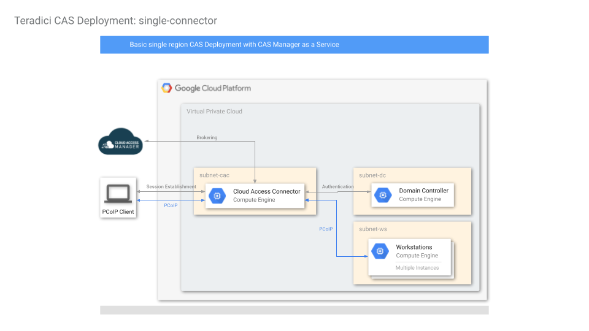
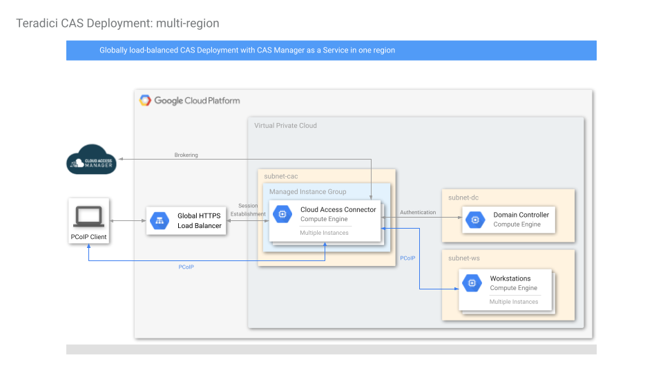
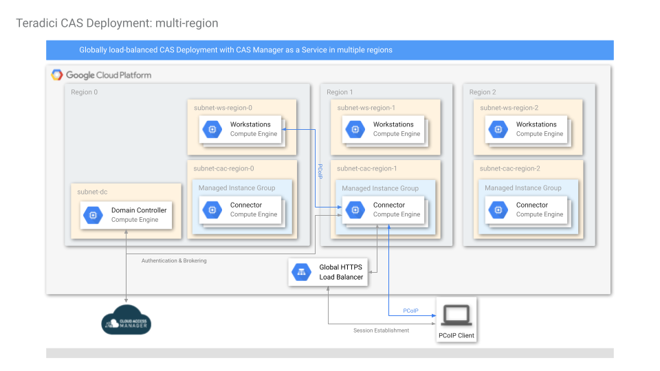
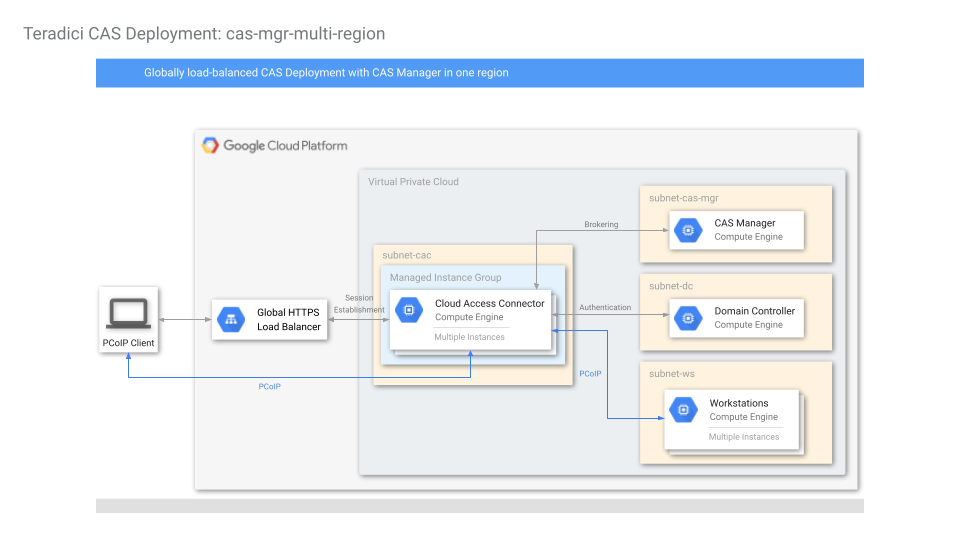
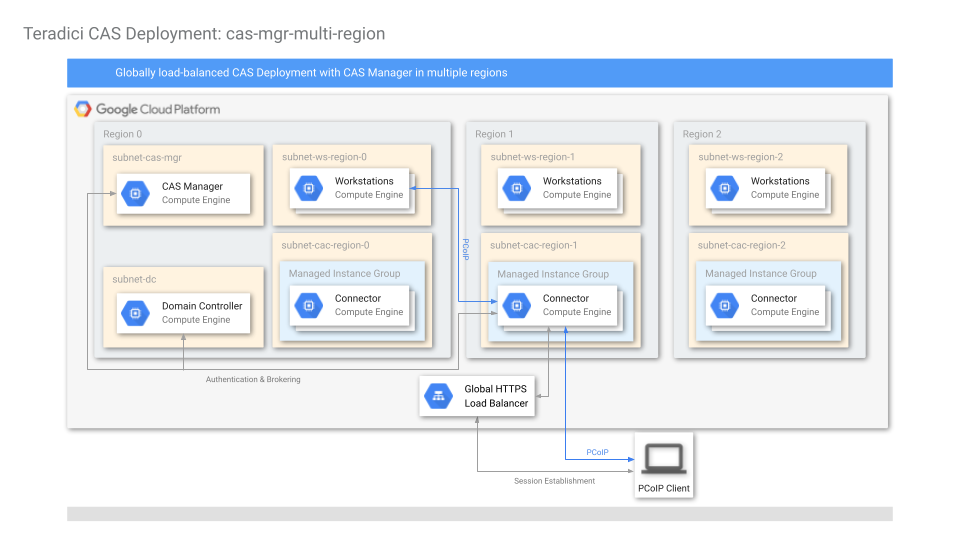
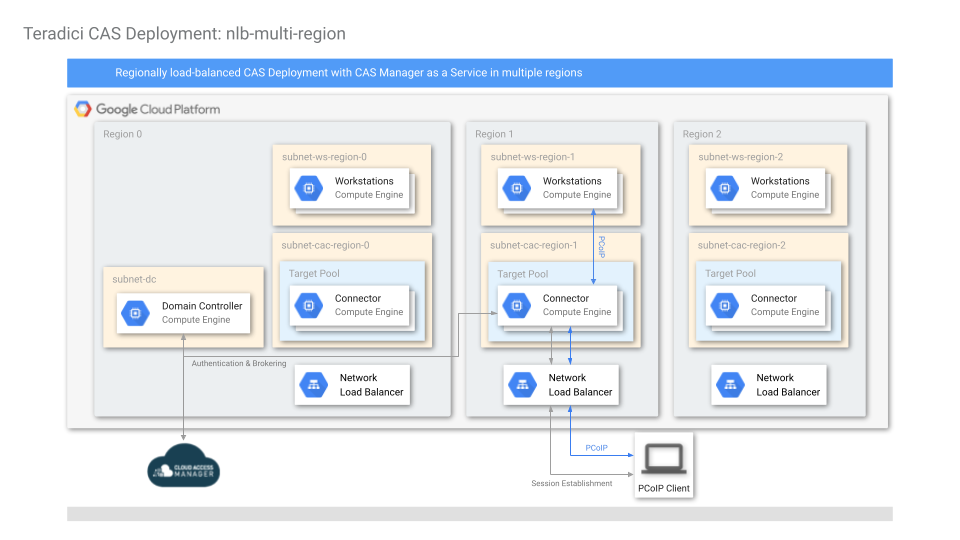

# GCP Deployment Types

## Table of Contents

- [Overview](#overview)
- [single-connector](#single-connector)
- [awm-single-connector](#awm-single-connector)
- [multi-region](#multi-region)
- [awm-multi-region](#awm-multi-region)
- [nlb-multi-region](#nlb-multi-region)
- [awm-nlb-multi-region](#awm-nlb-multi-region)
- [dc-only](#dc-only)

---

## Overview

This repository contains a number of HP Anyware deployment architectures on GCP. The tables below compare major differences between the deployments. Note that the deployments in the second table are essentially the same as those in the first table; the difference between them is how each HP Anyware deployment is managed:
1. using Anyware Manager as a Service, which is a SaaS run by Teradici (first table), or
2. running the Anyware Manager in a virtual machine that a user controls in his or her own HP Anyware deployment (second table)

Using Anyware Manager as a Service run by Teradici allows a user to rely on Teradici for running and maintaining the Anyware Manager without additional costs. Running the Anyware Manager in a virtual machine, on the other hand, gives the user full control of the HP Anyware deployment; the HP Anyware deployment will not have to reach out to the internet for HP Anyware management features, but the user is responsible for costs, security, updates, high availability and maintenance of the virtual machine running Anyware Manager.

| | single-connector | multi-region | nlb-multi-region |
| --- | --- | --- | --- |
| Description | Great for quick proof of concept. Only has one Connector in one region, limiting scalability.  | A global deployment supporting multiple Connectors in multiple regions running behind a global load balancer.  Each Connector is on a public subnet with its own public IP. PCoIP clients can access the deployment via a single global entry point. | A global deployment supporting multiple Connectors in multiple regions running behind regional load balancers.  Connectors are in private subnets without direct exposure to the internet. PCoIP clients can access the deployment via regional entry points. |
| # of Regions Supported | 1 | 1 or more | 1 or more |
| # of Connectors | 1 | 1 or more per region | 1 or more per region |
| # of PCoIP Entry Points | 1 (single Virtual Machine) | 1 (Global Load Balancer) | 1 per region (Regional Network Load Balancer) |
| Anyware Manager | as a Service | as a Service | as a Service |

| | awm-single-connector | awm-multi-region | awm-nlb-multi-region |
| --- | --- | --- | --- |
| Description | Great for quick proof of concept. Only has one Connector in one region, limiting scalability.  | A global deployment supporting multiple Connectors in multiple regions running behind a global load balancer.  Each Connector is on a public subnet with its own public IP. PCoIP clients can access the deployment via a single global entry point. | A global deployment supporting multiple Connectors in multiple regions running behind regional load balancers.  Connectors are in private subnets without direct exposure to the internet. PCoIP clients can access the deployment via regional entry points. |
| # of Regions Supported | 1 | 1 or more | 1 or more |
| # of Connectors | 1 | 1 or more per region | 1 or more per region |
| # of PCoIP Entry Points | 1 (single Virtual Machine) | 1 (Global Load Balancer) | 1 per region (Regional Network Load Balancer) |
| Anyware Manager | Virtual Machine | Virtual Machine | Virtual Machine |

## single-connector

This is the simplest HP Anyware deployment which uses Anyware Manager as a Service; it creates a VPC with 3 subnets in the same region. The subnets are
- `subnet-dc`: for the Domain Controller
- `subnet-cac`: for the Connector
- `subnet-ws`: for the workstations

Firewall rules are created to allow wide-open access within the VPC, and selected ports are open to the public for operation and for debug purposes.

A Domain Controller is created with Active Directory, DNS and LDAP-S configured. 2 Domain Admins are set up in the new domain: `Administrator` and `anyware_ad_admin` (default). Domain Users are also created if a `domain_users_list` CSV file is specified. The Domain Controller is given a static IP (configurable) and a public IP.

A Cloud Access Connector is created and registers itself with the Anyware Manager with the given Anyware Manager Deployment Service Account credentials.

Domain-joined workstations are optionally created, specified by the following parameters:
- `win_gfx_instance_count`:    Windows Graphics workstation
- `win_std_instance_count`:    Windows Standard workstation
- `centos_gfx_instance_count`: CentOS Graphics workstation
- `centos_std_instance_count`: CentOS Standard workstation

These workstations are automatically domain-joined and have the PCoIP Agent installed.  For graphics workstations, NVidia graphics driver is also installed.

## awm-single-connector

This deployment is essentially the same as [single-connector](#single-connector), except instead of using Anyware Manager as a Service provided by Teradici, the HP Anyware deployment is managed by Anyware Manager installed in a virtual machine in the `subnet-awm` subnet.

## multi-region

#### Note: Due to recent changes in how Google Load Balancer process headers, your current Zero Client or Software Client version may need to be updated.  Please contact the maintainer (see below) for help if you have trouble connecting through the Load Balancer. A temporary workaround is to connect to the public IP of the Cloud Access Connector directly, bypassing the Load Balancer.

The difference between [single-connector](#single-connector) and multi-region deployments is that instead of creating only one Cloud Access Connector, the multi-region deployment creates Cloud Access Connectors in managed instance groups, in one or more GCP regions, behind a single GCP Global HTTPS Load Balancer. Also, instead of creating workstations in one region, multi-region deployments support deploying workstations to multiple regions.

In this deployment, a client initiates a PCoIP session with the public IP of the Global HTTPS Load Balancer, and the Global HTTPS Load Balancer will select one of the Cloud Access Connectors from a region closest to the client to establish the connection. In-session PCoIP traffic goes through the selected Cloud Access Connector directly, bypassing the Global HTTPS Load Balancer.

The user can specify which zones to deploy workstations and which regions to deploy Cloud Access Connectors. Cloud Access Connectors within a region will be deployed as a Managed Instance Group with each instance spread out across available zones in the region.

The following diagram shows a deployment when only a single region is specified by the user.

The next diagram shows a deployment with Cloud Access Connectors and workstations specified for 3 regions. A user initiating a PCoIP session with the public IP of the GCP HTTPS Load Balancer will connect to one of the closest Cloud Access Connectors and use GCP's global network to connect to the workstation selected.

## awm-multi-region

This deployment is essentially the same as [multi-region](#multi-region), except instead of using Anyware Manager as a Service provided by Teradici, the HP Anyware deployment is managed by Anyware Manager installed in a virtual machine in the `subnet-awm` subnet.

## nlb-multi-region

The Network load-balanced (NLB) multi-region deployment creates workstations and Cloud Access Connectors in one or more GCP regions. Unlike other deployments, the Cloud Access Connectors in this deployment will not be assigned public IP addresses; instead, clients will connect to their workstations via the public IP address of a regional network load balancer.

Note that this deployment is ideal for clients connecting from different public IP addresses (e.g. in a work from home scenario). This deployment does not scale well for many clients connecting from the same IP address (e.g. employees from the same site) because the load balancer session affinity is based on source IP - which means clients connecting from the same public IP address will be handled by the same instance of Cloud Access Connector.

The user can specify which zones to deploy workstations and which regions to deploy Cloud Access Connectors. Cloud Access Connectors within a region will be spread out across available zones in the region, and will form a GCP target pool behind a GCP external Network Load Balancer with a public IP.

## awm-nlb-multi-region

This deployment is essentially the same as [nlb-multi-region](#nlb-multi-region), except instead of using Anyware Manager as a Service provided by Teradici, the HP Anyware deployment is managed by Anyware Manager installed in a virtual machine in the `subnet-awm` subnet.

## dc-only

A simple deployment of one Domain Controller, intended for testing Domain Controller operations.

Creates one VPC, one subnet and a single Domain Controller with ports opened for ICMP, RDP and WinRM.  Domain Controller is configured with Acitve Directory, DNS, LDAP-S.  One AD Service Account is also created.
